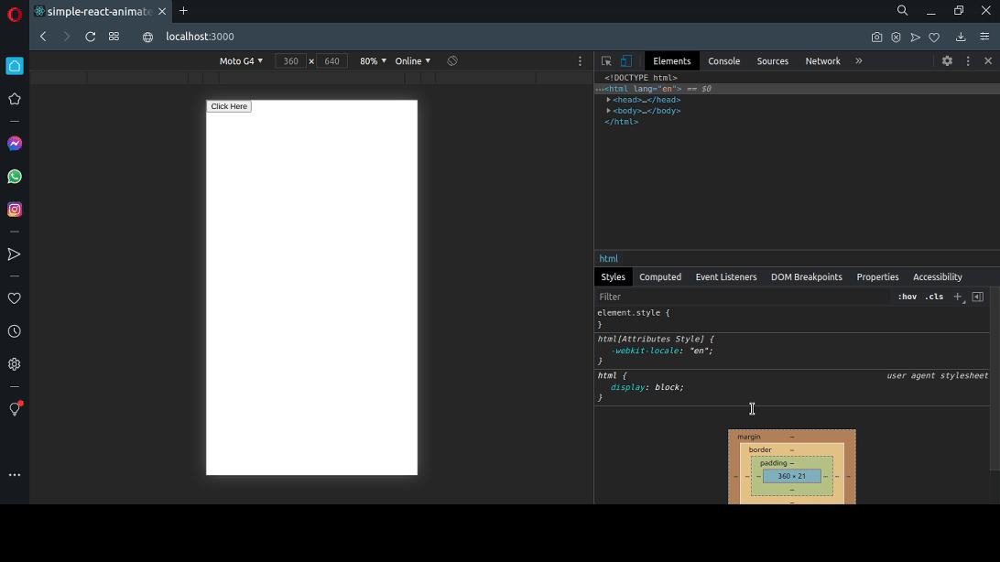

# simple-react-animated-modal

> A simple way to make an animated modal

[](https://www.npmjs.com/package/simple-react-animated-modal) [](https://standardjs.com)

<p align="center">
  
</p>

## Install

```bash
npm install --save simple-react-animated-modal
```

## Usage

```tsx
import React from 'react';

import MyComponent from 'simple-react-animated-modal';
import 'simple-react-animated-modal/dist/index.css';

function Example() {
  const [showModal, setShowModal] = useState(false);

  return (
    <div>
      <button onClick={() => setShowModal(true)}>Click Here</button>
      <AnimatedModal
        show={showModal}
        title="Example"
        onHide={() => setShowModal(false)}
        closeButton={<strong>X</strong>}
        style={{
          backgroundColor: '#1e2939',
          border: '2px solid #1cc5b7',
          color: 'white',
          boxShadow: '2px 2px 4px black',
        }}
        headStyle={{
          borderBottom: '1px solid white',
          height: '3.2rem',
        }}
      >
        <div className="modal-body">
          <p>This is an exemple.</p>
        </div>
      </AnimatedModal>
    </div>
  );
}
```

## License

MIT © [yuri014](https://github.com/yuri014)
